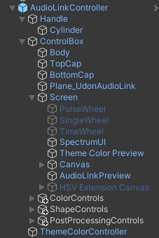
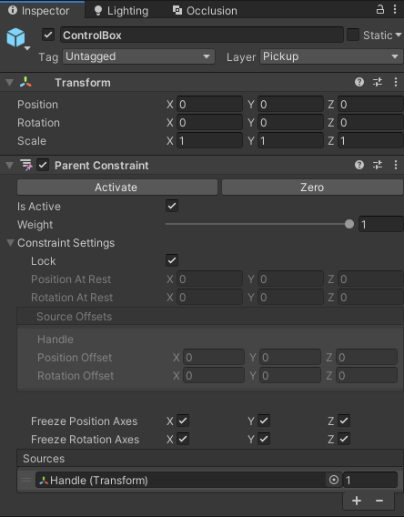
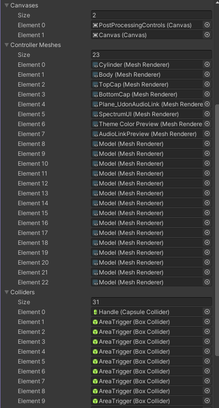
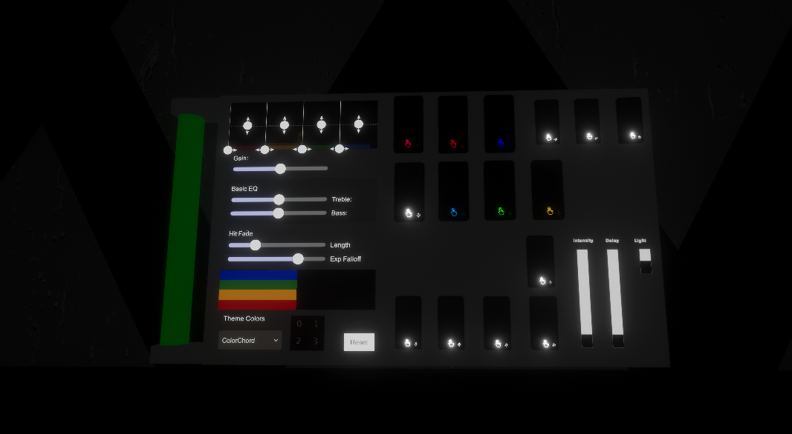

# VRCMobileController
Guide and scripts for creating a portable controller for world lighting / effects at live events. This controller is hidden from all players not on a whitelist and thus can be carried around your world freely. Examples will use the AudioLinkController prefab object, however this can work with other controllers. 

### Attaching extra controls to the AudioLinkController object

Add your GameObjects (buttons, sliders, etc) as children of the ControlBox.
As an example, I've provided my own setup which adds groups of buttons and a canvas of slider controls.
For instance, "ColorControls" is a GameObject with many buttons as children.

Note the Parent Contraint component on the ControlBox child of the AudioLinkController. This component will always take the Handle object as its source transform. Any buttons or sliders you attach by adding a child to the ControlBox will need the same setup. I recommend grouping your controls this way to avoid adding ParentConstraint components to each button or canvas you may need to add.

As an example above, "ColorControls" is a GameObject that holds many buttons as children. Only the top parent, "ColorControls" will need the ParentConstraint component on it to be locked to the rest of the controller.

Once everything is placed in your preferred position, the constraint setting needs to be enabled to "Lock" for each parent that has this component.

### Using the hide script
At this point you should be able to add the [provided script](https://github.com/FRILLZ-VR/VRCMobileController/blob/main/LocalHideUIWhitelist.cs) into your project.  I recommend right clicking in your unity asset folder and choosing "Create new U# script", and then pasting the provided code in its entirety.

This script hides all meshes, canvases, and colliders for everyone except those permitted on the whitelist. It is independent of the controller and can be placed on any object in the scene, preferbaly an empty GameObject. Simply drag your elements to each group and provide the VRC usernames of who you would like to be able to see the controller. Since no game objects are toggled off, all scripts should behave as normal for your buttons, and sliders, for everyone else, however non whitelisted users will not be able to see or interact with the controller.

In this example, I'll be dragging in the mesh components from the AudioLinkController, as well as my own buttons and their respective colliders and two canvas elements:

The controller in question has many extra controls for my world. You may use any button or slider prefab you prefer.

